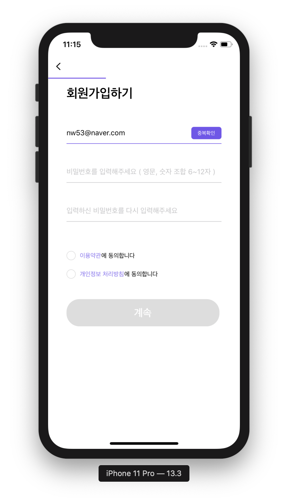

### 1. [addTarget](https://developer.apple.com/documentation/mediaplayer/mpremotecommand/1622895-addtarget)을 이용한 제약 사용하기!

emailTextField와 pwTextField 둘 다 입력해야 버튼이 활성화 되며 색이 바뀌는걸 하고 싶어요~

1. LoginViewController의 class안에서 textfield Outlet들을 선언해준다.

2. delegate 선언을 해준다.		

  ~~~swift 
	  **self**.emailTextField.delegate = **self**
  	**self**.pwTextField.delegate = **self**
  ~~~

   

3. 

   ~~~swift 
   emailTextField.addTarget(**self**, action: **#selector**(textFieldDidChange), for: .editingChanged)
      pwTextField.addTarget(**self**, action: **#selector**(textFieldDidChange), for: .editingChanged)
   
   ~~~
   emailTextField에 addTarget을 쓸거고, self이니 emailTextField 자신에게 action: textFieldDidChange을 사용할건데, editingChanged, textfield가 편집될때마다 기능이 사용된다.

4. 

   ~~~swift 
   @objc func textFieldDidChange(){
    		if emailTextField.text != "" && pwTextField.text != ""  {
       self.logInBtn.backgroundColor = UIColor.mainPurple  					   						self.logInBtn.isEnabled = true
    }else {
   		  self.logInBtn.backgroundColor = UIColor.veryLightGray
   	    self.logInBtn.isEnabled = false
   ~~~

​    

### 2. 정규식 사용하기

   

정규식 표현이 길기때문에 extension 파일을 만들어서 빼주었습니다.

~~~

   
extension String {

      func isValidEmailAddress() -> Bool {
		  let emailRegEx = "[A-Z0-9a-z._%+-]+@[A-Za-z0-9.-]+\\.[A-Za-z]{2,}"
    	let emailTest = NSPredicate(format:"SELF MATCHES %@", emailRegEx)
   		return emailTest.evaluate(with: self)
     }

   }
~~~

   

   ### 3. [Progress Bar](https://developer.apple.com/documentation/uikit/uiprogressview)사용하기

   

   
   

   라는게 생겼어요~~ (원래 있을수도 있음)

   뷰컨에 추가 하구요 

   여러가지 설정을 해줍니다~ 오토도 잡고요 색도 주고요 ~

   

   아울렛을 선언해 줍니다~~

   ~~~swift 
   @IBOutlet weak var progressView: UIProgressView!
   ~~~

   ProgressBar의 핵심은 애니메이션이죠? 

~~~swift
   UIView.animate(withDuration: 3.0) {
    self.progressView.setProgress(0.3, animated: true)
	  self.progressView.tintColor = .mainPurple          
   }
~~~
   withDuration은 3초동안 하는거고요~~

   setProgress(0.3) 은 화면의 0.3 만큼이고 animated를 true로 줍니다.

   

     
     

   [여러가지 animation Options]https://hyerios.tistory.com/13

   
