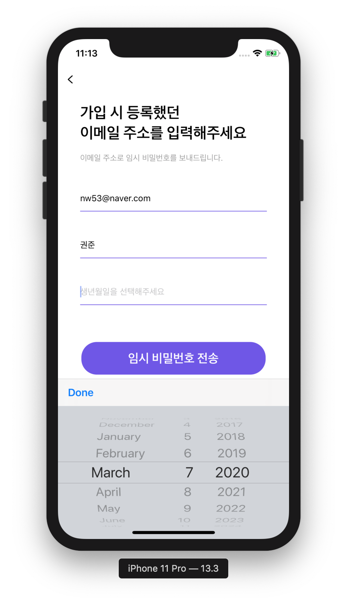
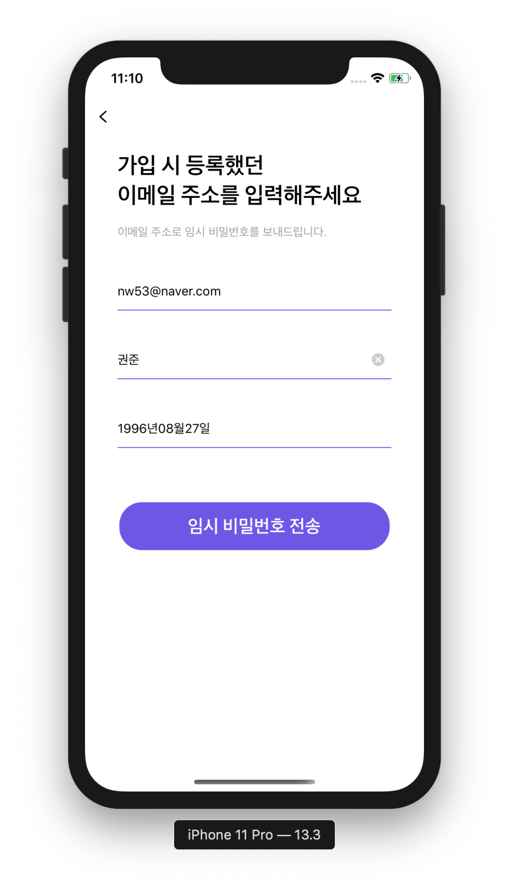

### 1. UITextField와 DatePicker를 연동하기!

1. LoginViewController의 class안에서 textfield Outlet와 datePicker를 선언한다.

   ​		

  ~~~swift 
@IBOutlet weak var birthTextField: UITextField!
let datePicker = UIDatePicker()
  ~~~

   

2. dataPicker 함수를 만들어준다.

~~~swift 
func createDatePicker() {
        datePicker.datePickerMode = .date // 생년월일을 받아올 것이기 때문에 date형식으로 받음
        let toolbar = UIToolbar()
        toolbar.sizeToFit()
        
        let doneBtn = UIBarButtonItem(barButtonSystemItem: .done, target: self, action: #selector(pressDone)) // done버튼 눌렀을때 행동을 selector로 받아 올 것
        toolbar.setItems([doneBtn], animated: false)
        
        birthTextField.inputAccessoryView = toolbar
        birthTextField.inputView = datePicker
    }

~~~
3. Done을 눌렀을때의 함수를 만들어준다.

~~~swift 
    @objc func pressDone() {
        let dateFormatter = DateFormatter()
        dateFormatter.dateStyle = .short 
        dateFormatter.timeStyle = .none
        dateFormatter.dateFormat = "yyyy년 MM월 dd일"
        birthTextField.text = dateFormatter.string(from: datePicker.date)
        self.view.endEditing(true)
    }
~~~

​    

4. 그리고 viewDidLoad 안에 함수만 선언해주면 끝!!